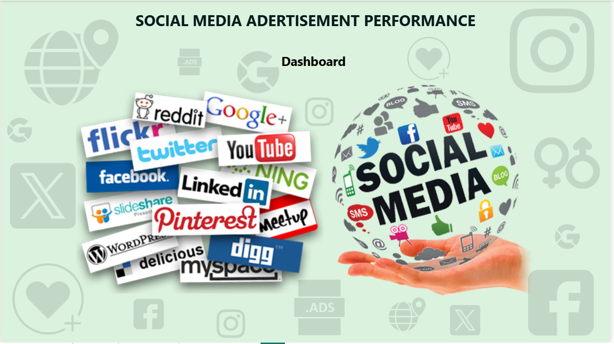
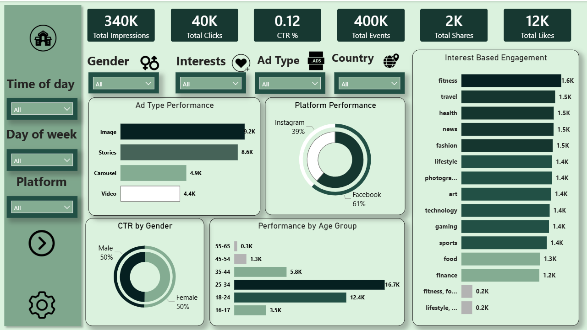
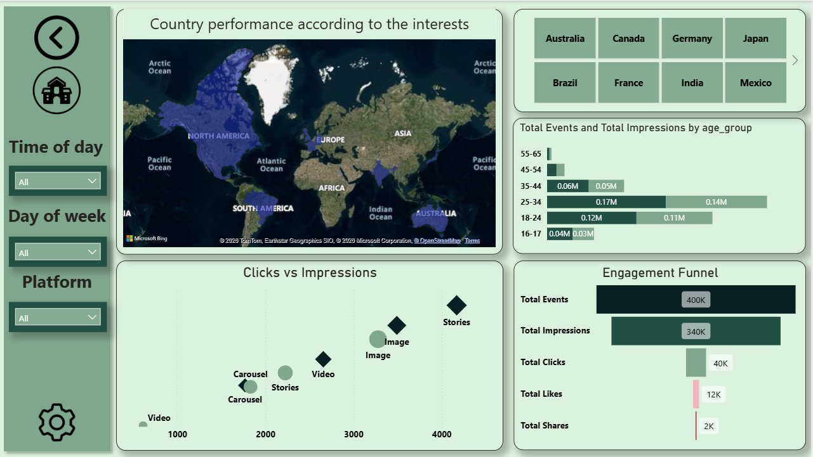

# -FUTURE_DS_03

# 📊 Social Media Advertisement Performance Dashboard

## 📌 Overview

This project is an interactive Power BI dashboard designed to analyze the performance of social media advertising campaigns. The dashboard focuses on understanding user engagement, advertisement effectiveness, and audience behavior across different platforms.

The analysis highlights how factors such as **ad type, platform, user demographics, interests, and time patterns** influence overall advertisement performance. It provides clear insights into key engagement metrics including impressions, clicks, click-through rate (CTR), events, likes, and shares.

The dashboard helps identify **high-performing ad formats, target audience segments, and engagement trends** to support better data-driven marketing decisions.

---
These datasets include information related to:

* Advertisement type and platform
* User demographics (age group and gender)
* User interests
* Engagement metrics (impressions, clicks, events, likes, shares)
* Time-based campaign attributes

The data was structured and modeled to support efficient analysis and visualization.

---

## 📐 Key Features

### 🔹 KPI Metrics

* Total Impressions
* Total Clicks
* Click Through Rate (CTR %)
* Total Events
* Total Likes
* Total Shares

### 🔹 Advertisement Performance Analytics

* Ad Type Performance (Image, Stories, Carousel, Video)
* Platform Performance (Facebook vs Instagram)
* CTR Comparison by Gender
* Performance by Age Group

### 🔹 Audience Engagement Insights

* Interest-Based Engagement Analysis
* Demographic Engagement Patterns
* Platform-wise Interaction Distribution

### 🔹 Interactive Filters

Users can dynamically explore the data using filters for:

* Time of Day
* Day of Week
* Platform
* Gender
* Interests
* Advertisement Type

---
## 📊 Business Value

This dashboard enables:

* Identification of the most effective advertisement formats
* Understanding audience engagement across different platforms
* Analysis of demographic segments with the highest interaction rates
* Discovery of interest categories that generate the most engagement
* Data-driven optimization of social media marketing campaigns

---

## 🛠 Tools Used

* Power BI Desktop
* Data Modeling
* DAX (Data Analysis Expressions)
* Data Visualization Techniques

---

## 📷 Dashboard Preview

---

## 👩‍💻 Author

**Lavanya Rayudu**
